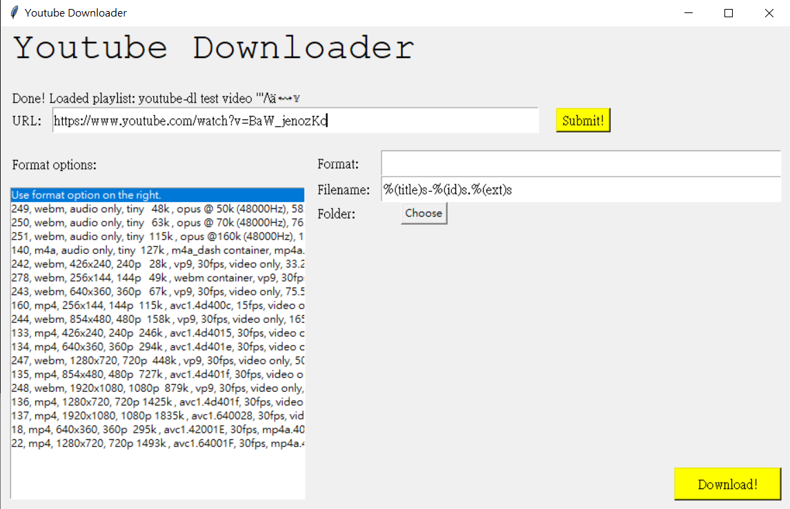
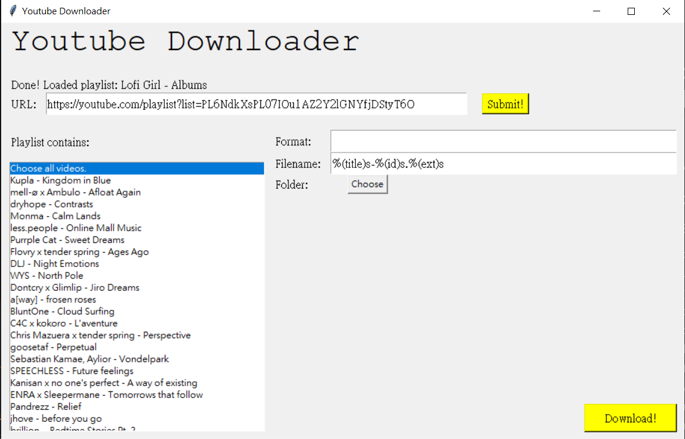

# Youtube-Downloader-Tkinter
Small youtube downloader.

## How to Use
Run the program `main.py`. You need things like `youtube_dl` and `tkinter`.

Put the URL of youtube video or playlist into URL entry and submit, and you will see some options and list of videos or format to choose from.

### Video

You can choose which format code do you want, or choose `Use format option on the right.` to use the format specification on the right.

Format option is written the same as how you use `youtube_dl`'s `-f` parameter. The same applies to filename. Please refer to [youtube-dl](https://github.com/ytdl-org/youtube-dl) for more detailed options.

After setting up all things, you can click `Download!` to start downloading. This will not block the program due to the use of threading. i.e. Clicking only registers downloading task.

If anything goes wrong when registering the download task, you should see the message on top of `Download!` button.

### Playlist

You can download playlists, by choosing (possibly) multiple videos on the left.

As long as you choose the option `Choose all videos.`, it will simply download all videos, ignoring other choices you might also choose.

They will be downloaded using the format options on the right.

## How to Add Options
This program doesn't really follow all sorts of OOP cleverness, rendering fixing it a kind of hassle.

Basically all options are in `SettingFrame`. You could add stuff in and return appropriate `ydl_opts` according to senarios, e.g. only return needed settings for download in `getDownloadSpecificOptions()`, etc.